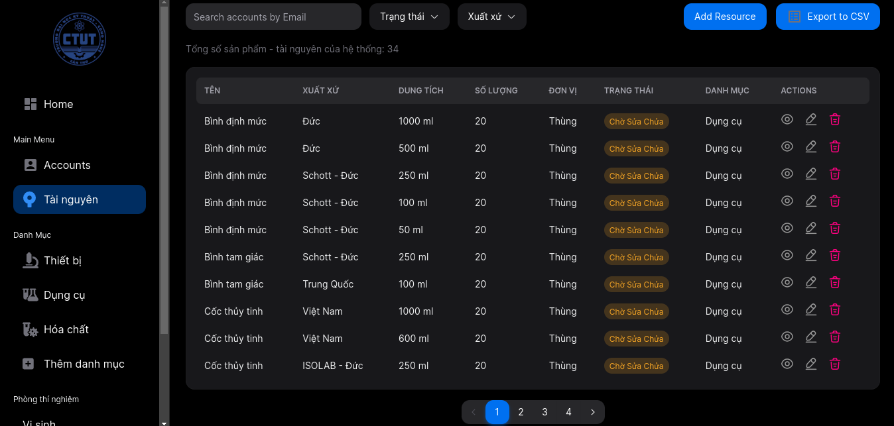

# Laboratory Management Admin using NextJS and NexUI

Thanks to [Siumauricio](https://github.com/Siumauricio) and contributors for creating and perfecting this base template

This is a project that uses NextJS and NextUI to build an admin dashboard for lab management

NextJS: [NextJS](https://nextjs.org/) </br>
NextUI: [NextUI](https://nextui.org/)

You can see the demo here: [https://nextui-dashboard-template.vercel.app/](https://laboratory-management-admin.vercel.app/) </br>
And public API: https://laboratory-management-system.onrender.com/apis

You may need to wait for fetching data because we used free hosting :)))

If you want to use this API please contact locnguyen071102@gmail.com


### Dashboard Resources Page


### Sample structure
```
├── components
│   ├── accounts            # Accounts components
│   ├── charts              # Charts components
│   ├── breadcrumb          # component
|   ├── home                # Home components
|   ├── layout              # Layout components
|   ├── navbar              # Navbar components
|   ├── sidebar             # Sidebar components
|   ├── table               # Table components
|   ├── styles              # Some reusable components
|   ├── icons               # Icons
|   ├── hooks               # Hooks
├── app                     # Documentation files
│   ├── accounts            # Accounts route
|       ├── page.tsx        # Accounts page
│   ├── page.tsx            # Entry point for the app
│   ├── layout.tsx          # Layout applied to all application pages
│   ├── providers.tsx       # Theme provider
│   ├── more...             # Soon
└──
```
## Feature
Waiting for update ....
